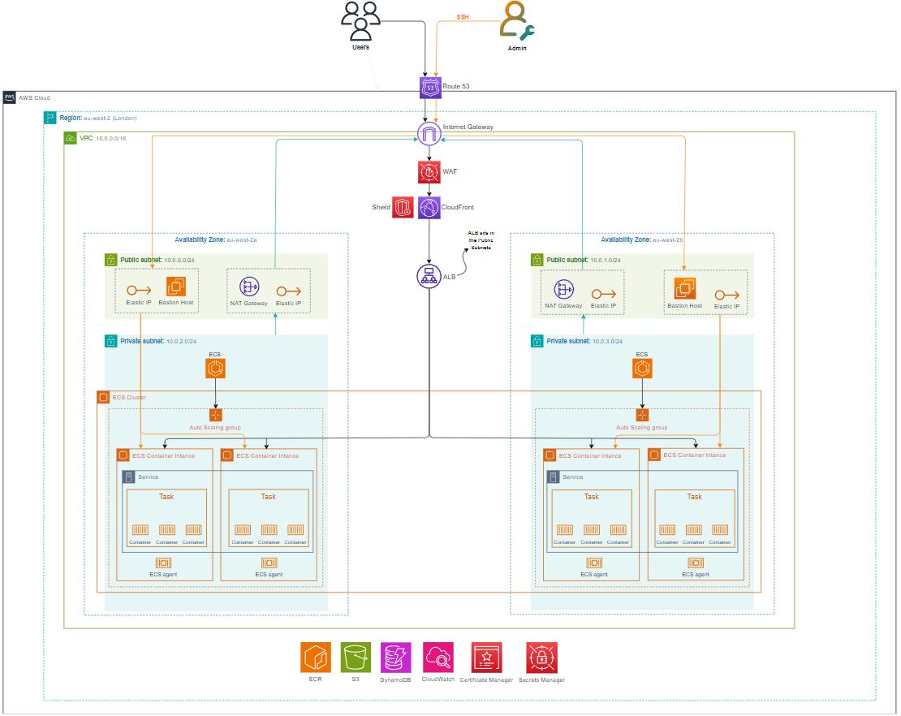

# JD Sports In-Store App

A web application designed for JD Sports staff to quickly look up product information and sales pitches for in-store staff.

## Features

- Product search by code
- Detailed product specifications
- Sales pitch information for staff
- Responsive design for various devices
- Error handling for invalid product codes

## Tech Stack

### Frontend
- React.js
- React Router
- Axios for API calls
- Custom CSS
- Jest/React Testing Library

### Backend
- Node.js
- Express
- MongoDB/Mongoose
- Jest for testing

### Infrastructure
- Terraform for infrastructure as code
- AWS ECS for container orchestration
- AWS ECR for container registry
- GitHub Actions for CI/CD
- Nginx for web serving

## Getting Started

### Prerequisites
- Node.js 16+
- npm or yarn
- Docker (for containerised development)

### Development Setup

1. Clone the repository:
```bash
git clone [repository-url]
```

2. Install client dependencies:
```bash
cd client
npm install
```

3. Install server dependencies:
```bash
cd server
npm install
```

4. Start the development servers:

Client:
```bash
cd client
npm start
```

Server:
```bash
cd client
npm start
```

5. Running Tests:

Client:
```bash
cd client
npm test
```

Server:
```bash
cd server
npm test
```

## Deployment
The application is automatically deployed using GitHub Actions when changes are pushed to the main branch. The pipeline:

1. Build the Docker images
2. Pushes to Amazon ECR
3. Updates ECS services
4. Handles infrastructure changes via Terraform

## Project Structure
```bash
├── client/                 # React frontend
├── server/                 # Node.js backend
├── infrastructure/         # Terraform IaC
├── nginx/                  # Nginx configuration
├── server-configuration/   # Ansible
└── .github/workflows/      # CI/CD pipeline
```

## Infrastructure Architecture

